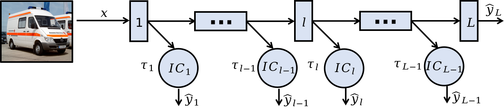

# Early Exit Neural Network

## Introduction
This repository provides an implementation of Early Exit Neural Network. The code is based on PyTorch and provides a way to train a regular CNN model and an Early Exit Neural Network. The code also provides a way to profile the processing time of the model.

### What is Early Exit Neural Network?
Early Exit Neural Networks are an innovative approach to optimize deep learning models, particularly in resource-constrained environments such as edge devices. These networks are designed with intermediate exit points that allow predictions to be made without traversing the entire model, reducing computation time and energy consumption. 


More details about Early Exit Neural Network can be found in this [paper](https://ieeexplore.ieee.org/abstract/document/7900006)

### Why use Early Exit Neural Networks?
- ***Energy Efficiency***: Reduces energy consumption, making it suitable for energy-constrained environments.
- ***Real-Time Applications***: Improves response time for applications like video processing, real-time monitoring, and autonomous systems.
- ***Cost-Effective***: Decreases the operational cost of deploying AI systems by utilizing less computational power.
- ***Prevent Overthinking***: Prevents the model from overthinking and making wrong predictions by allowing early exits.
- ***Flexibility***: Provides flexibility by choosing the appropriate exit thresholds based on the application requirements.

### Comparing Early Exit Neural Network with Regular CNN
The table below demonstrates the performance of the Early Exit Neural Network (EENN) on CIFAR-10 and ImageNet-1k datasets running with ***AMD Ryzen 7 PRO 3700 8-Core Processor***. Metrics include accuracy, inference time, and energy consumption for models with and without early exits.

| Dataset      | Model Type     | Accuracy (%) | Inference Time (ms/sample) | 
|--------------|----------------|--------------|----------------------------|
| CIFAR-10     | ResNet50       | 94.65        | 30.0                       |
| CIFAR-10     | EENN-ResNet50  | 91.03        | 14.8                       |
| ImageNet-1k  | ResNet101      | 81.95        | 96.0                       |
| ImageNet-1k  | EENN-ResNet101 | 79.27        | 51.7                       |

## Requirements
- Python 3.8+
- install required packages by `pip install -r requirements.txt`

## Usage
Implemented backbones
- ResNet (50, 101)
- VGG (11, 13, 16, 19)

You can implement your own model with the `BaseModel` class in `src/nn/model/base_model.py`. 

The custom model should have the following properties before building the corresponding Early Exit Neural Network:
- `self.backbone`: The backbone layers of the model
- `self.classifier_module`: The classifier module of the model. Default is `ClassifierHead` in `src/nn/model/classifier.py`
- `self.classifier_config`: The input arguments for initialize the classifier module

Here is an example to define your own model:
```python
from src.nn.model.base_model import BaseModel

class YourModel(BaseModel):
    def __init__(self, *args, **kwargs):
        super(YourModel, self).__init__(*args, **kwargs)
        # Define your model here
```

### Train regular CNN model
An example to train a ResNet model on CIFAR 10, you can use the following command:
```bash
python train_model.py --dataset cifar --num_classes 10 --test_split test --model resnet50 --epoch 10 --cuda --verbose
```
To check more arguments, you can use `python train_model.py --help`

### Train Early Exit Neural Network
An example to train a ResNet model on CIFAR 10 with early exit, you can use the following command:
```bash
python train_model.py --dataset cifar --num_classes 10 --test_split test --model resnet50 --ee 3 5 7 9 11 13 15 17 19 --pretrained <path_to_pretrained_regular_model> --epoch 10 --cuda --verbose
```
description
Two examples to use the trained model for inference are provided in `example.py`.

### Profiling model
To profile the processing time of each layer in the model, and get the data size of the intermediate result, you can use the following command:
```bash
python model_profiling.py --model_path <model_path> --data_path <data_path> --save_folder <save_folder> --mode 0 1 2 3 4 5 6 7 --gate
```
- `data_path`: The path to the images

The result will be saved in `<save_folder/profile_summary.json>`

- `profile_summary['backbone_execution_time']['layer_name']`: processing time of each layer in backbone.
- `profile_summary['gate_execution_time']['layer_name']`: processing time of layers in each gate.

### Download Pretrained Model
You can download the pretrained model from https://huggingface.co/chanyikchong/Early-Exit-Neural-Network or by using the following command:
```bash
python download_pretrained_model.py --save_dir <save_folder>
```

### Loading Pretrained Model
You can load the pretrained model by using the following command:
```python
from src.nn.model import load_model

model = load_model("model_folder")
```

### Citation This Repository
If you find this repository useful, please consider citing it:
```bibtex
@inproceedings{Chen2025CEED,
  author    = {Yichong Chen and Zifeng Niu and Manuel Roveri and Giuliano Casale},
  title     = {{CEED: Collaborative Early Exit Neural Network Inference at the Edge}},
  booktitle = {Proceedings of the IEEE International Conference on Computer Communications (INFOCOM)},
  year      = {2025},
  month     = {May},
  pages     = {TBD},  % Update with actual page numbers when available
  doi       = {TBD},  % Update with DOI when available
}
```
